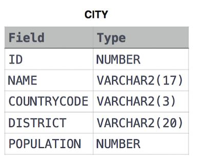
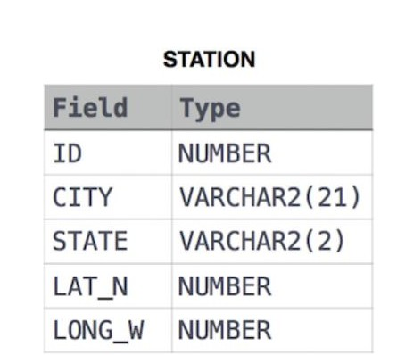

# Basic Select

## 1 Revising the select query I

Query all columns for all American cities in the **CITY** table with populations larger than `100000`. The **CountryCode** for America is `USA`. 

The **CITY** table is described as follows:  



### **SQL Query**

MySQL

```sql
SELECT * FROM CITY 
WHERE COUNTRYCODE = 'USA'
AND POPULATION > 100000;
```


### **Output**

```bash
3878 Scottsdale USA Arizona 202705 
3965 Corona USA California 124966 
3973 Concord USA California 121780 
3977 Cedar Rapids USA Iowa 120758 
3982 Coral Springs USA Florida 117549 
```


## 2 Revising the select query II

Query the **NAME** field for all American cities in the **CITY** table with populations larger than `120000`. The *CountryCode* for America is `USA`.

The **CITY** table is described as follows:


### **SQL Query**

MySQL

```sql
SELECT NAME FROM CITY
WHERE COUNTRYCODE = 'USA'
AND POPULATION > 120000;
```


### **Output**

```bash
NAME
Scottsdale
Corona
Concord
Cedar Rapids
```


## 3 Select by ID

Query all columns for a city in **CITY** with the *ID* `1661`.

The **CITY** table is described as follows: 


### **SQL Query**

MySQL

**Example 1**

```sql
SELECT * FROM CITY
WHERE ID=1661;
```


**Example 2**

```sql
SELECT * FROM CITY
WHERE ID LIKE 1661;
```

### 

### **Output**

```bash
1661 Sayama JPN Saitama 162472
```


## 4 Japanese Cities' Attributes

Query all attributes of every Japanese city in the **CITY** table. The **COUNTRYCODE** for Japan is `JPN`.  

The **CITY** table is described as follows: 


### **SQL Query**

MySQL

**Example 1**

```sql
SELECT * FROM CITY 
WHERE countrycode='JPN';
```


**Example 2**

```sql
SELECT * FROM CITY 
WHERE countrycode LIKE 'JPN';

-- LIKE  "Strings like JPN, in some percent"
```

### 

### **Output**

```bash
1613 Neyagawa JPN Osaka 257315
1630 Ageo JPN Saitama 209442
1661 Sayama JPN Saitama 162472
1681 Omuta JPN Fukuoka 142889
```


## 5 Japanese Cities' Names

Query the names of all the Japanese cities in the **CITY** table. The **COUNTRYCODE** for Japan is `JPN`.
The **CITY** table is described as follows:


### **SQL Query**

MySQL

**Example 1**

```sql
SELECT NAME FROM CITY 
WHERE countrycode='JPN';
```


**Example 2**

```sql
SELECT NAME FROM CITY 
WHERE countrycode LIKE 'JPN';

-- LIKE  "Strings like JPN, in some percent"
```

### 

### **Output**

```bash
Neyagawa 
Ageo 
Sayama 
Omuta 
Tokuyama
```


## 6 Weather Observation 1

Query a list of **CITY** and **STATE** from the **STATION** table. 
 The **STATION** table is described as follows: 




where **LAT_N** is the northern latitude and **LONG_W** is the western longitude.


### **SQL Query**

MySQL

**Example 1**

```sql
SELECT CITY, STATE FROM STATION;

```

### **Output**

```bash
Kissee Mills MO
Loma Mar CA
Sandy Hook CT
Tipton IN
Arlington CO
Turner AR
Slidell LA
Negreet LA
Glencoe KY
Chelsea IA
Chignik Lagoon AK
Pelahatchie MS

```

